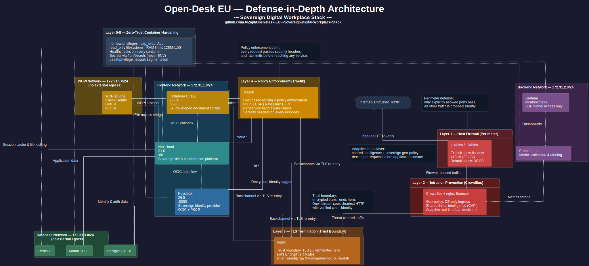

# Open-Desk EU — Sovereign Digital Workplace Stack

Containerized, self-hosted digital workplace suite designed for EU data sovereignty. Deployed with Docker Compose behind Traefik reverse proxy, following Zero Trust principles with Defense-in-Depth security hardening.

<p align="center">
  
</p>

## Architecture

```
Internet → nginx (TLS termination) → Traefik (routing) → Service containers
                                                           ├── Nextcloud 31 (file sync & collaboration)
                                                           │   ├── notify_push (WebSocket push)
                                                           │   └── Whiteboard (real-time drawing)
                                                           ├── Keycloak 26.5 (SSO / OIDC identity provider)
                                                           ├── Collabora Online (document editing via WOPI)
                                                           ├── Prometheus + Grafana (metrics & dashboards)
                                                           ├── Netdata (real-time system monitoring)
                                                           ├── Rocket.Chat (messaging) [planned]
                                                           ├── Jitsi Meet (video conferencing) [planned]
                                                           ├── OpenProject (project management) [planned]
                                                           └── Vaultwarden (password management) [planned]
```

## Security

All services follow the container hardening baseline documented in [`docs/CONTAINER_HARDENING_BASELINE.md`](docs/CONTAINER_HARDENING_BASELINE.md). Full security architecture and audit results are documented in [`SECURITY.md`](SECURITY.md).

Key principles:

- **Network Segmentation** — 5 isolated Docker networks; database and WOPI networks are fully internal (no internet access)
- **Least Privilege** — `cap_drop: ALL` on every container, minimal `cap_add` per service; `no-new-privileges` per container (documented exceptions for Collabora and Netdata)
- **Secrets as Files** — Docker Compose `secrets:` block, no plaintext credentials in compose files or environment variables
- **Immutable Infrastructure** — Read-only filesystems where possible, explicit tmpfs for runtime data
- **Centralized IAM** — Keycloak OIDC with Authorization Code Flow + PKCE for all services
- **Host Intrusion Prevention** — CrowdSec with geoblocking and community threat intelligence
- **Automated Verification** — [`scripts/verify-network-routing.sh`](scripts/verify-network-routing.sh) validates ports, networks, routing, headers, WOPI, and DNS

## Repository Structure

```
compose/
├── traefik/          Reverse proxy + TLS termination + middleware definitions
├── keycloak/         Identity provider (production build) + PostgreSQL
├── nextcloud/        File sync + MariaDB + Redis + Cron + notify_push
├── collabora/        Document editing (CODE) + seccomp profile
├── whiteboard/       Real-time collaborative whiteboard (WebSocket)
└── observability/    Prometheus + Grafana + Netdata
docs/                 Architecture decisions, hardening baseline, network routing, performance tuning
secrets/              Credential files (git-ignored, chmod 700)
scripts/              Verification, backup, deployment, DDNS scripts
docker-compose.yml    Root orchestrator (network definitions)
```

## Project Status

| Component | Status |
|---|---|
| Host Security (firewall, auditd, CrowdSec) | ✅ Complete |
| Docker Network Segmentation | ✅ 5 networks, DB + WOPI internal |
| Traefik Reverse Proxy | ✅ Security headers, rate limiting, HSTS |
| Keycloak 26.5 IAM | ✅ Production build, OIDC clients, 2FA (TOTP + WebAuthn) |
| Nextcloud 31 | ✅ OIDC SSO, performance-tuned (OPcache/JIT, APCu, InnoDB) |
| Nextcloud High Performance Backend | ✅ notify_push (WebSocket push notifications) |
| Collabora Online | ✅ WOPI integration, document editing, seccomp-sandboxed |
| Whiteboard | ✅ Real-time collaborative drawing via WebSocket |
| Observability (Prometheus + Grafana + Netdata) | ✅ Metrics collection + dashboards |
| TLS (Let's Encrypt) | ⏳ Planned for DNS go-live |
| Rocket.Chat | ⏳ Planned |
| Jitsi Meet | ⏳ Planned |
| OpenProject | ⏳ Planned |
| Vaultwarden | ⏳ Planned |

## Technology Stack

- **Containerization:** Docker + Docker Compose (13 containers across 6 compose projects)
- **Reverse Proxy:** Traefik v3 with automatic service discovery
- **Identity Management:** Keycloak 26.5 (OIDC / OAuth 2.0, production build)
- **File Sync:** Nextcloud 31 with Redis caching + notify_push
- **Document Editing:** Collabora Online (CODE) via WOPI protocol
- **Real-time Collaboration:** Whiteboard (Excalidraw-based, WebSocket)
- **Databases:** PostgreSQL 16 (Keycloak), MariaDB 11 (Nextcloud, InnoDB-tuned)
- **Caching:** Redis 7 (session + file locking), APCu (local PHP object cache)
- **Monitoring:** Prometheus + Grafana (metrics), Netdata (real-time), auditd (host audit)
- **Host Security:** CrowdSec (IPS with geoblocking), UFW (firewall)
- **Host OS:** Ubuntu Server

## Key Documentation

| Document | Purpose |
|---|---|
| [`SECURITY.md`](SECURITY.md) | Full security architecture, container audit, secrets management |
| [`docs/NETWORK_ROUTING_OVERVIEW.md`](docs/NETWORK_ROUTING_OVERVIEW.md) | Authoritative reference for port, routing, and DNS decisions |
| [`docs/CONTAINER_HARDENING_BASELINE.md`](docs/CONTAINER_HARDENING_BASELINE.md) | Mandatory security directives for every container |
| [`docs/NEXTCLOUD_PERFORMANCE_OPTIMIZATION.md`](docs/NEXTCLOUD_PERFORMANCE_OPTIMIZATION.md) | Performance tuning concept (OPcache, InnoDB, Redis, notify_push) |
| [`scripts/verify-network-routing.sh`](scripts/verify-network-routing.sh) | Automated infrastructure verification script |
| [`.env.example`](.env.example) | Template for deployment-specific configuration |

## Configuration

All deployment-specific values are centralized in a single `.env` file. Compose files reference these variables via `${VAR}` interpolation — no hardcoded domains, IPs, or paths in any compose file.

```bash
cp .env.example .env
# Edit .env with your deployment values
```

| Variable | Purpose | Example |
|---|---|---|
| `DOMAIN_CLOUD` | Nextcloud domain | `cloud.example.com` |
| `DOMAIN_IAM` | Keycloak domain | `id.example.com` |
| `DOMAIN_OFFICE` | Collabora domain | `office.example.com` |
| `HOST_IP` | Server LAN IP (for port bindings and WOPI routing) | `192.168.1.100` |
| `LAN_SUBNET` | Local network CIDR | `192.168.1.0/24` |
| `TRAEFIK_PORT` | Traefik HTTPS entrypoint (host-side) | `8443` |
| `NET_FRONTEND` .. `NET_WOPI` | Docker network subnets | `172.31.1.0/24` .. `172.31.5.0/24` |
| `DATA_DIR` | Base path for persistent volumes | `/srv/opendesk-data` |
| `GRAFANA_PORT` | Grafana dashboard (localhost only) | `3000` |

See [`.env.example`](.env.example) for the complete template with all variables and defaults.

## Quick Start

```bash
# 1. Clone and configure
cp .env.example .env
# Edit .env — at minimum set DOMAIN_*, HOST_IP, and DATA_DIR

# 2. Create secrets
mkdir -p secrets && chmod 700 secrets
# Generate credentials — see .env.example for the full list

# 3. Create data directories
sudo mkdir -p /srv/opendesk-data/{keycloak/db,mariadb,nextcloud,prometheus,grafana}
sudo chmod 700 /srv/opendesk-data

# 4. Create Docker networks (see docs/NETWORK_ROUTING_OVERVIEW.md)
for net in opendesk_frontend opendesk_backend opendesk_db opendesk_mail opendesk_wopi; do
  docker network create "$net" --subnet <see .env.example>
done
# Mark DB and WOPI as internal (no internet access)

# 5. Deploy services (order matters)
docker compose --env-file .env -f compose/traefik/docker-compose.yml up -d
docker compose --env-file .env -f compose/keycloak/docker-compose.yml up -d
docker compose --env-file .env -f compose/nextcloud/docker-compose.yml up -d
docker compose --env-file .env -f compose/collabora/docker-compose.yml up -d
docker compose --env-file .env -f compose/whiteboard/docker-compose.yml up -d
docker compose --env-file .env -f compose/observability/docker-compose.yml up -d

# 6. Verify
bash scripts/verify-network-routing.sh
```

## License

This repository contains infrastructure configuration for a personal project. No license is granted for commercial use.
